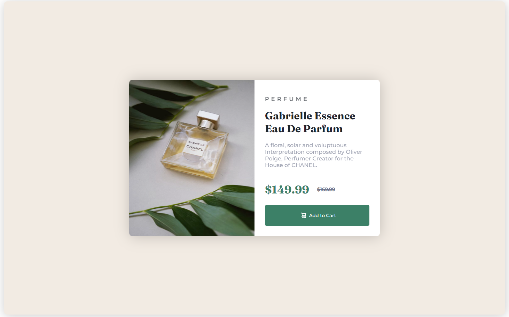
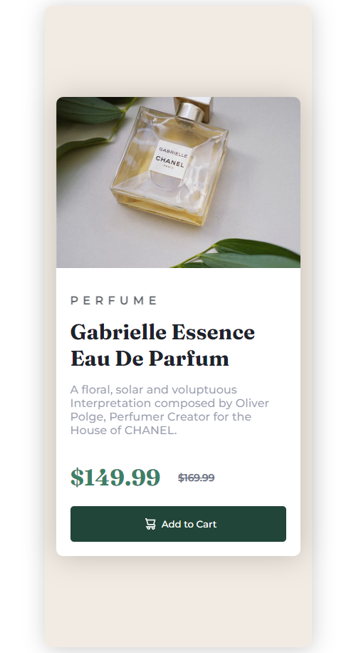

# Frontend Mentor - Product preview card component solution

:) Hey!
This is a solution to the [Product preview card component challenge on Frontend Mentor](https://www.frontendmentor.io/challenges/product-preview-card-component-GO7UmttRfa). Frontend Mentor challenges help you improve your coding skills by building realistic projects.

## Table of contents

- [Built with](#built-with)
- [What I learned](#what-i-learned)
- [Author](#author)

### The challenge

Users should be able to:

- View the optimal layout depending on their device's screen size
- See hover and focus states for interactive elements

### Screenshot




### Links

- Solution URL: [Add solution URL here](https://github.com/Bally14/product-previw-card-solution.git)

## My process

#### The HTML Part

First I tried to dissect the different sections of the Layout.
To me, it seemed like having a container, then a card where 2 divs resides inside (foto and description) would be the way to go.

```html
<div class="container">
  <div class="card">
    <div class="foto">
      
    </div>
    <div class="foto-mobile">
      
    </div>
    <div class="description">...</div>
  </div>
</div>
```

#### The CSS Part

I honestly "googled" myself into an accurate CSS solution. Through try-and-error and 4 hours of reading whatever ressources I could find to get the job done, I think I kind of nailed it.
The CSS part was very messy, so thats why i can't really explain what is going on and what kind of thought process I had while doing it so I would be more than thankful if someone reviewed it and gave me constructive feedback!

### Built with

- Html
- CSS

### What I learned

After a Basic understanding of HTML and CSS, I was able to use media query to make the layout responsive in a way that it would change depending on the view port width

```css
@media screen and (max-width: 600px) {
}
```

## Author

- Frontend Mentor - [@Bally14](https://www.frontendmentor.io/profile/Bally14)
